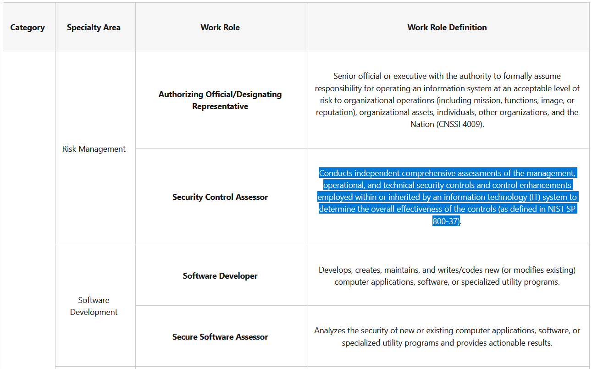

# May the Workforce Be With You (4 points)

## Question:

Conducts independent comprehensive assessments of the management, operational, and technical security controls and control enhancements employed within or inherited by an information technology (IT) system to determine the overall effectiveness of the controls (as defined in NIST SP 800-37).

## Answer:

Security Control Assessor

## Solution:

We can browse through the NICE Cybersecurity Workforce Framework of Work Roles at the following website:

https://niccs.cisa.gov/nice-cybersecurity-workforce-framework-work-roles

All of the Work Roles and their descriptions are listed here, so we can do a simple CTRL+F search to find our solution:

So, our answer is Security Control Assessor.

| [Previous Challenge](/Challenges/Securely-Provision/1/README.md) | [Return to Challenges](/Challenges/../../../#modules) | [Next Challenge](/Challenges/Securely-Provision/3/README.md) |
| :------- | :-----: | ------: |