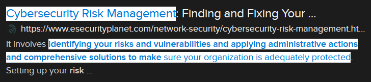

# Safe Keeper (4 points)

## Question:

The process of identifying your risks and vulnerabilities and applying administrative actions and comprehensive solutions to make sure your organization is adequately protected.

### Answer:

Cybersecurity Risk Management

### Solution:

We can perform a Google search on the given definition to get the following search result:

Based on our search, the solution to the challenge is "Cybersecurity Risk Management".

| [Previous Challenge](/Challenges/Securely-Provision/2) | [Return to Challenges](/Challenges/../../../#modules) | [Next Challenge](/Challenges/Securely-Provision/4) |
| :------- | :-----: | ------: |