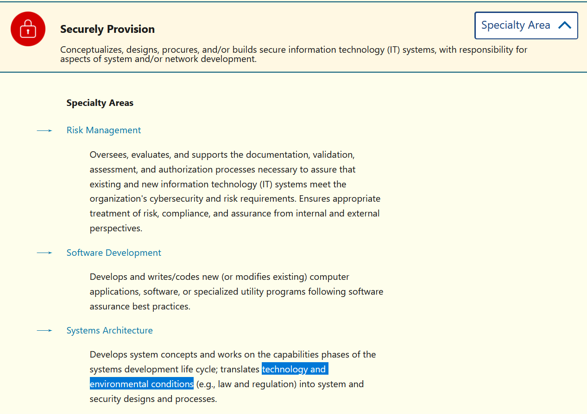

# Secure By Design (5 points)

## Question:

Professionals in this specialty area under the Securely Provision category help us to translate technology and environmental conditions into system and security designs and processes.

## Answer:

Systems Architecture

## Solution:

The NICE Cybersecurity Framework for Categories/Specialty Areas can be found at the following website:

https://niccs.cisa.gov/workforce-development/cyber-security-workforce-framework?category=Analyze

We can expand the Securely Provision area and then use our browser's search feature using CRTL-F and the search term "technology and environmental conditions" to find the following Specialty Area:

The solution to the challenge is the name of the Specialty Area, which is Systems Architecture.

| [Previous Challenge](/Challenges/Securely-Provision/3/README.md#question) | [Return to Challenges](/Challenges/../../../#modules) | [Next Challenge](/Challenges/Securely-Provision/5/README.md#question) |
| :------- | :-----: | ------: |