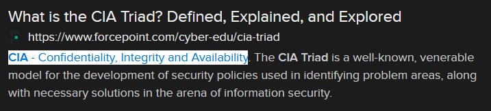

# Honesty is Best Policy (6 points)

## Question:

This aspect of the CIA triad is about ensuring that information is not altered accidentally or by entities unauthorized to make alterations.

## Answer:

Integrity

## Solution:

We can perform a Google search on the given definition to get the following search result:

Based on our search, the possible answers are Confidentiality, Integrity, and Availability. Looking back at the challenge question, "ensuring that information is not altered accidentally or by entities unauthorized to make alterations" most closely relates to Integrity.

| [Previous Challenge](/Challenges/Securely-Provision/4/README.md) | [Return to Challenges](/Challenges/../../../#modules) | [Next Challenge](/Challenges/Securely-Provision/6/README.md) |
| :------- | :-----: | ------: |