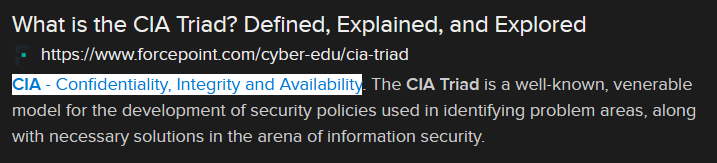

# Obscuring Data (6 points)

## Question:

This aspect of the CIA Triad refers to protecting information from disclosure to unauthorized parties.

## Answer:

Confidentiality

## Solution:

We can perform a Google search on the given definition to get the following search result:

Based on our search, the possible answers are Confidentiality, Integrity, and Availability. Looking back at the challenge question, "protecting information from disclosure to unauthorized parties" most closely relates to Confidentiality.

| [Previous Challenge](/Challenges/Securely-Provision/5/README.md#top) | [Return to Challenges](/Challenges/../../../#modules) | [Next Challenge](/Challenges/Securely-Provision/7/README.md#top) |
| :------- | :-----: | ------: |