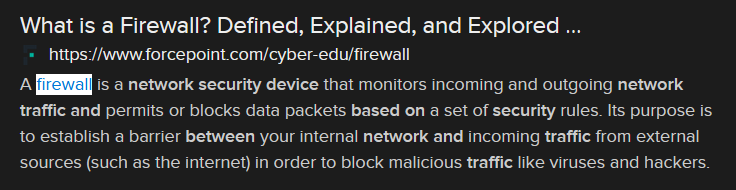

# Ouch, Hot! (8 points)

## Question:

Which type of network security device is used to limit traffic between networks and information systems based on network addresses and port numbers?

## Answer:

Firewall

## Solution:

We can perform a Google search on the given definition to get the following search result:

Based on our search, the solution to the challenge is "firewall".

| [Previous Challenge](/Challenges/Securely-Provision/6/README.md#top) | [Return to Challenges](/Challenges/../../../#modules) | [Next Challenge](/Challenges/Securely-Provision/8/README.md#top) |
| :------- | :-----: | ------: |