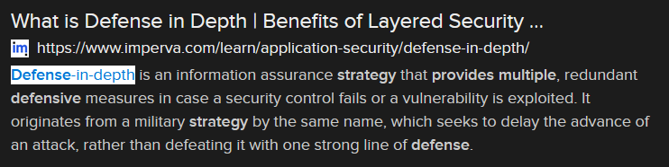

# Medieval (15 points)

## Question:

Which network defensive strategy relies on multiple layers of defense to provide enhanced protection in case one layer is penetrated?

## Answer:

Defense in depth

## Solution:

We can perform a Google search on the given definition to get the following search result:

Based on our search, the solution to the challenge is "defense in depth".

| [Previous Challenge](/Challenges/Securely-Provision/7/README.md#question) | [Return to Challenges](/Challenges/../../../#modules) | Next Challenge |
| :------- | :-----: | ------: |