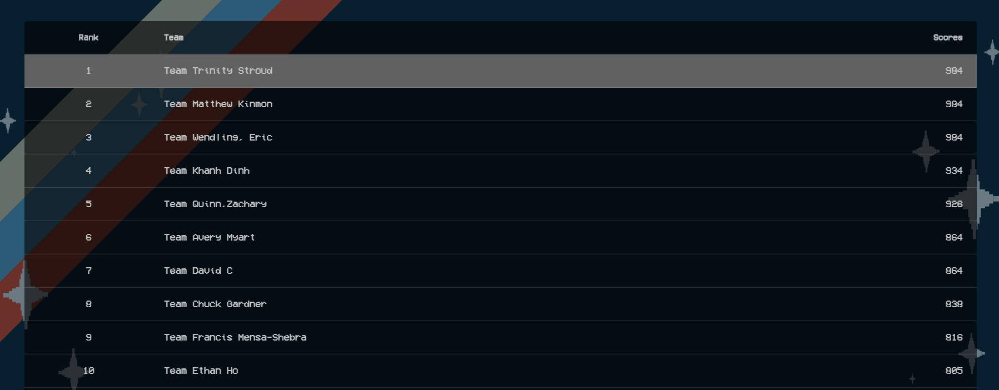

# National Cybersecurity Career Awareness Week (NCCAW) 2020 Competition

Are you a student who would like to learn how to get involved in capture-the-flag competitions? This CTF will include categories such as cryptography, networking, trivia, cybersecurity careers, web applications, reconnaissance, and more!

## Performance

**Rank:** 1st Place *(out of 120 competitors)*\
**Score:** 984 / 984 *(100%)*\
**Completion:** 62 / 62 *(100%)*\
**Hints:** 0

## Modules

### Analyze
* [Nice Knowledge](Challenges/Analyze/1/README.md#top)
* [Take Me Higher](Challenges/Analyze/2/README.md#top)
* [Languages](Challenges/Analyze/3/README.md#top) *First Blood!*
* [Missing Letters](Challenges/Analyze/4/README.md#top)
* [Where Art Thou?](Challenges/Analyze/5/README.md#top)
* [Don't Panic](Challenges/Analyze/6/README.md#top)
* [White Hats](Challenges/Analyze/7/README.md#top)
* [Insecure Protocols](Challenges/Analyze/8/README.md#top)
* [File Extraction](Challenges/Analyze/9/README.md#top)
* [Binwalk It Off](Challenges/Analyze/10/README.md#top)
* [Nothing To See Here](Challenges/Analyze/11/README.md#top)

### Collect & Operate
* [How Many?](Challenges/Collect-And-Operate/1/README.md#top)
* [Mad Skillz](Challenges/Collect-And-Operate/2/README.md#top)
* [O*Net-SOC](Challenges/Collect-And-Operate/3/README.md#top)
* [What's the Plan?](Challenges/Collect-And-Operate/4/README.md#top)
* [Encoded Data](Challenges/Collect-And-Operate/5/README.md#top)
* [Penetration Test](Challenges/Collect-And-Operate/6/README.md#top) *First Blood!*
* [Strange Sounds](Challenges/Collect-And-Operate/7/README.md#top)

### Investigate
* [Career Pathway](Challenges/Investigate/1/README.md#top)
* [Got Talent?](Challenges/Investigate/2/README.md#top)
* [Indefensible?](Challenges/Investigate/3/README.md#top)
* [Rowing to Forensics](Challenges/Investigate/4/README.md#top)
* [Crime Scene Investigation](Challenges/Investigate/5/README.md#top)
* [Steganography](Challenges/Investigate/6/README.md#top)
* [Security Identifier](Challenges/Investigate/7/README.md#top)
* [File Recovery](Challenges/Investigate/8/README.md#top)

### Operate & Maintain
* [How to Unlock!](Challenges/Operate-And-Maintain/1/README.md#top)
* [Nice Knowledge](Challenges/Operate-And-Maintain/2/README.md#top)
* [Role Play](Challenges/Operate-And-Maintain/3/README.md#top)
* [Ethernet to IP](Challenges/Operate-And-Maintain/4/README.md#top)
* [Taking Advantage](Challenges/Operate-And-Maintain/5/README.md#top)
* [Corned Beef?](Challenges/Operate-And-Maintain/6/README.md#top)
* [XOR What?](Challenges/Operate-And-Maintain/7/README.md#top)
* [FTP Attack](Challenges/Operate-And-Maintain/8/README.md#top)

### Oversee & Govern
* [Crypto-ing](Challenges/Oversee-And-Govern/1/README.md#top)
* [Nice Knowledge](Challenges/Oversee-And-Govern/2/README.md#top)
* [Rollin'](Challenges/Oversee-And-Govern/3/README.md#top)
* [Use It or Lose It](Challenges/Oversee-And-Govern/4/README.md#top)
* [Lots of Jobs!](Challenges/Oversee-And-Govern/5/README.md#top)
* [Lots o' Stuff](Challenges/Oversee-And-Govern/6/README.md#top)
* [New Roles](Challenges/Oversee-And-Govern/7/README.md#top)
* [Neuromancer](Challenges/Oversee-And-Govern/8/README.md#top)
* [Big Bossman](Challenges/Oversee-And-Govern/9/README.md#top)

### Protect & Defend
* [Law and Order](Challenges/Protect-And-Defend/1/README.md#top)
* [Let Me In!](Challenges/Protect-And-Defend/2/README.md#top)
* [Making Connections](Challenges/Protect-And-Defend/3/README.md#top) *First Blood!*
* [007](Challenges/Protect-And-Defend/4/README.md#top)
* [Overlords](Challenges/Protect-And-Defend/5/README.md#top)
* [Catch Me If You Can](Challenges/Protect-And-Defend/6/README.md#top)
* [Underground](Challenges/Protect-And-Defend/7/README.md#top)
* [Hostage](Challenges/Protect-And-Defend/8/README.md#top)
* [hsabtA](Challenges/Protect-And-Defend/9/README.md#top)
* [Gold Digging](Challenges/Protect-And-Defend/10/README.md#top) *First Blood!*
* [Password Audit](Challenges/Protect-And-Defend/11/README.md#top)

### Securely Provision
* [Anonymous](Challenges/Securely-Provision/1/README.md#top)
* [May the Workforce Be With You](Challenges/Securely-Provision/2/README.md#top)
* [Safe Keeper](Challenges/Securely-Provision/3/README.md#top)
* [Secure By Design](Challenges/Securely-Provision/4/README.md#top) *First Blood!*
* [Honesty is Best Policy](Challenges/Securely-Provision/5/README.md#top)
* [Obscuring Data](Challenges/Securely-Provision/6/README.md#top)
* [Ouch, Hot!](Challenges/Securely-Provision/7/README.md#top)
* [Medieval](Challenges/Securely-Provision/8/README.md#top)

[**Back to Top**](#modules)